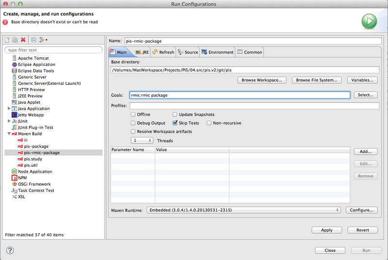

Maven - Generate RMI stub classes
==========================================

**转自：<http://gazer4kanlin-nba.logdown.com/posts/178112-maven-generate-rmi-stub-classes>**

RMI 在 JDK 1.4 版時，會需要利用 rmic 替 RMI interface 產生 stub/skeleton，而 JDK 1.5 以後的版本不再需要這個步驟。但這卻造成以 JDK 1.5 開發的 client 試圖去呼叫 JDK 1.4 開發的 Server 時，出現 ClassNotFound 的 Exception，造成這個例外錯誤的原因，就是因為少了 stub 的 class。

因此，需要先將 stub 產生出來才能 package，也才能正確執行 RMI 服務。

因為專案屬於 Maven Project，可以利用 build plugin 在 package 前先將 stub 產生好。


Plugin
------------------------------------------

RMI Compiler Maven Plugin 會利用 rmic 將 RMI interface 的 sub class 產生出來。

* phase: process-classes
* goal: rmic:rmic

**pom.xml**

```
<plugin>
    <groupId>org.codehaus.mojo</groupId>
    <artifactId>rmic-maven-plugin</artifactId>
    <version>1.2.1</version>
    <configuration>
        <outputDirectory>${project.build.outputDirectory}</outputDirectory>
    </configuration>
</plugin>
```

`${project.build.outputDirectory} `指向專案資料夾內的 `target/classes`，所以輸出的 stub classes 會和 compile 的結果重疊在一起，package 時就會一併壓縮到 jar 檔內。

Eclipse Project Configuration
---------------------------------------------
